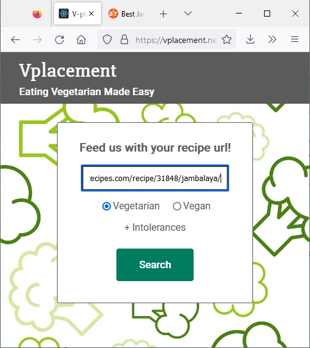

# Vplacement

This project contains python code to access the Spoonacular API and to transform a recipe into a vegetarian one. The end result cannot be viewed at anymore, because the free Heroku server on which the Python Flask API was deployed is not available since December 2022. Before, you could simply paste the URL of your favorite recipe and find a similar vegetarian one, paste e.g. https://www.foodnetwork.com/recipes/food-network-kitchen/chicken-and-broccoli-stir-fry-recipe-1942670

## The steps for finding your recipe

1. Go to the website (not possible anymore).

2. Paste the URL of the website with your favorite recipe.

3. Press search.

4. Look at similar, vegetarian recipes and select the one of interest.

5. Find the ingredients.

6. Cook the recipe with the instructions.
